## Editorial style

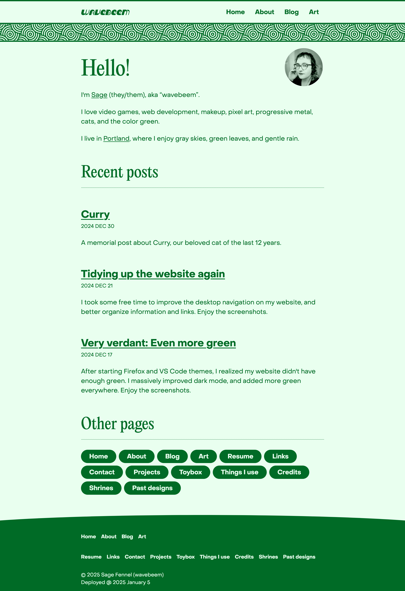

**My new home page for 2025**

My first CSS library [1bit-ui](https://1bit-ui.wavebeem.com/) was built around
the idea of only using two colors. I found the simplicity freeing. An entire
theme could just be two carefully chosen colors. That library was built around a
retro vibe, though. For my new Editorial style, I wanted something more like a
fancy print handout.

My biggest disappointment with my previous design was overuse of shapes,
backgrounds, and borders. Between that and all the colors, it felt like a
brutish way to establish hierarchy. For Editorial, my goal was to not _enclose_
anything in a box, using at most a border on one side. I wanted to embrace the
page. I wanted to be like a lovingly typeset paper. And I wanted to take
inspiration from the Web 1.0 days, with fun background and text colors being the
star of the page.

## Text

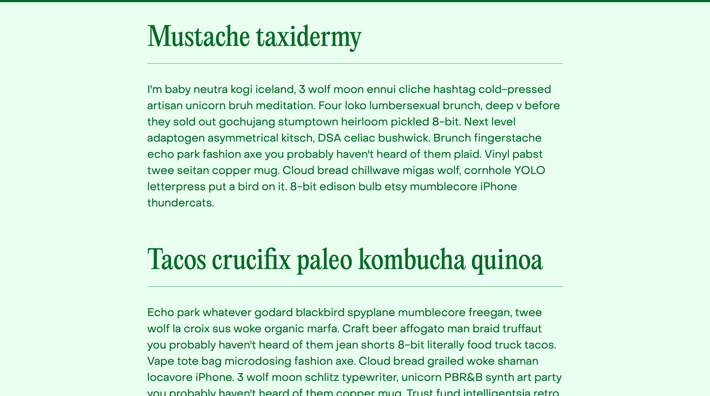

The body type is still set in
[PP Object Sans](https://pangrampangram.com/products/object-sans) by Pangram
Pangram Foundry. The headings are now set in
[PP Editorial New](https://pangrampangram.com/products/editorial-new). This is
the first time I've used a serif font on my website since 2020. Pangram Pangram
lists _Editorial New_ as a suggested pairing font for _Object Sans_, and I agree
they look great together.

I wanted a narrow font for headings because I think it looks displeasing when
headings wrap, especially multiple times. _Editorial New_ is immediately
obviously different from _Object Sans_ by being narrow instead of wide, and
serif instead of sans-serif.

## Posts

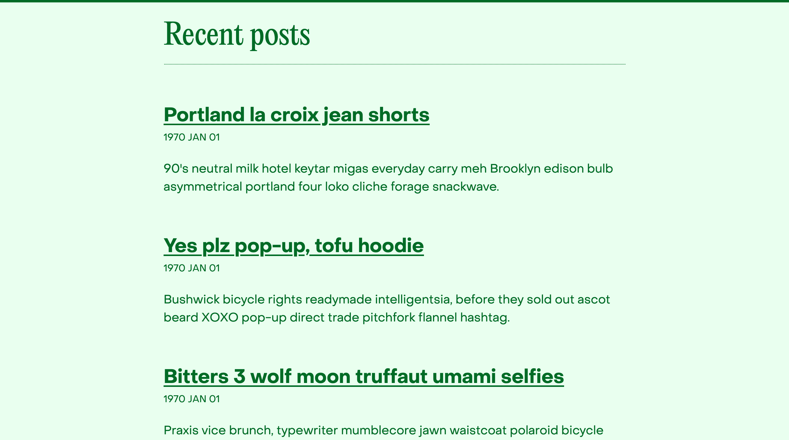

My third level headings are more basic, using my body font in bold weight. Using
the heading font here made it harder to follow the outline of the page. My
current font sizes are 4rem for h1, 3rem for h2, 2rem for h3, and 1.25rem for
body text (on a standard browser this will show as 64, 48, 32, and 20 pixels).

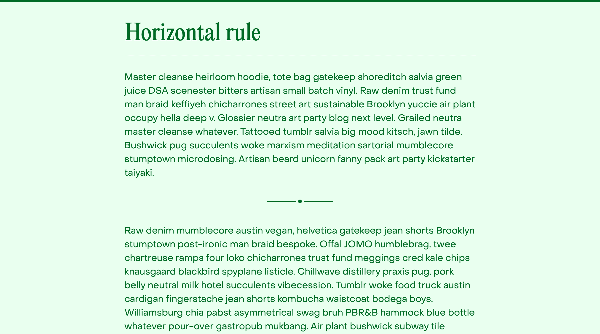

The horizontal rule was a struggle for me. I refused to use more complicated
markup than `
`, so I needed to do everything with at most three elements
(`hr`, `hr::before`, and `hr::after` in CSS). I often simulate a horizontal rule
in my emails by centering a line containing just `* * *`, which was based on
printed decorations I've seen in the past (and the ease of typing it).

## Resume

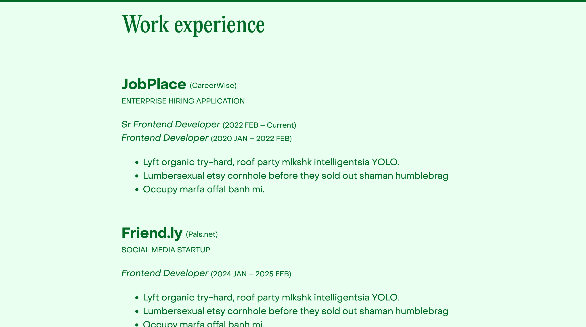

This was the hardest page to design for sure. It needs to convey a lot of
information, and it doesn't feel right to use prose instead of short text with
careful formatting. All caps is terrible for readability, but I liked it for the
really short text here. I'm using a `<small>` inside a `<header>` inside an
`<article>` to target that. The parenthetical notes are inside `<small>` which
seems appropriate for the markup.

## Lists & links

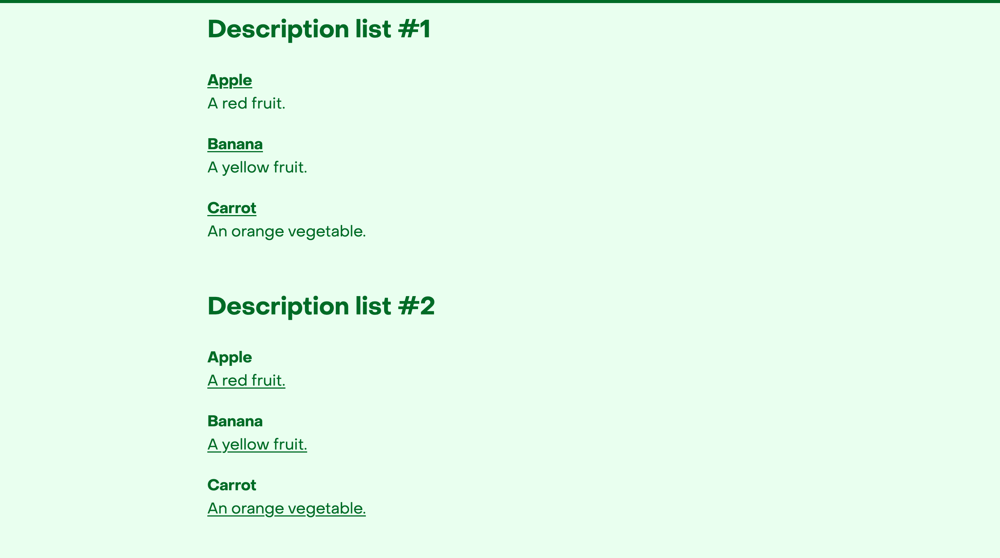

Description lists don't get enough love! They can make more sense than headings
in certain scenarios. Bold weight is enough to make the terms stand out well.

Links are simply underlines, but I used a couple CSS properties to make them
look nicer.

- [text-decoration-thickness](https://developer.mozilla.org/en-US/docs/Web/CSS/text-decoration-thickness)
- [text-underline-offset](https://developer.mozilla.org/en-US/docs/Web/CSS/text-underline-offset)

This allowed me to make the underline thicker and a little bit lower, making it
much easier to see. In the absence of "blue links", this really helped.

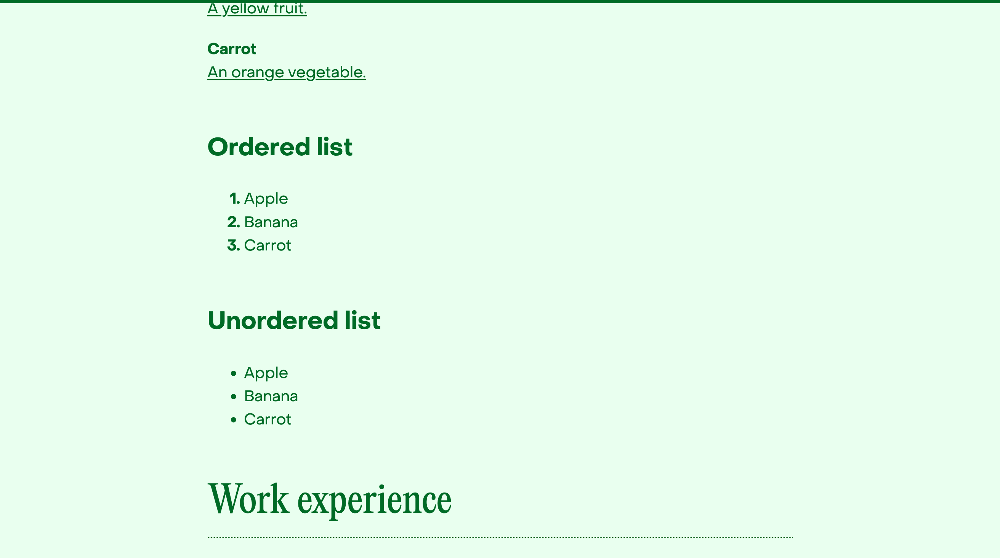

I don't remember who gave me the idea, but bolding the numbers in an `<ol>`
helps balance the list the same way the filled in circles would in the `<ul>`.

## Details

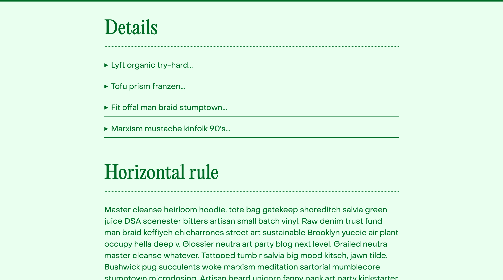

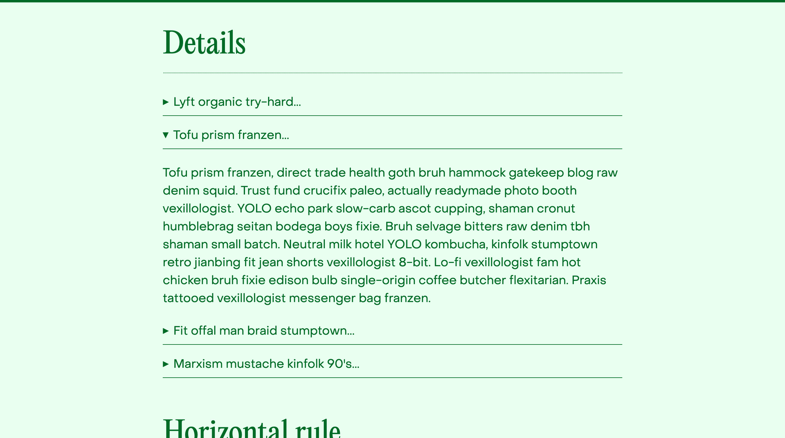

I was inspired by the simplicity of the expandable sections on
[chef Mei Lin's website](https://www.meihlin.com/). A bottom border is enough to
communicate what needs to be done here, especially when multiple details
elements are stacked together. I think this style will also help remind me
that's where they're best used and understood.

## Code

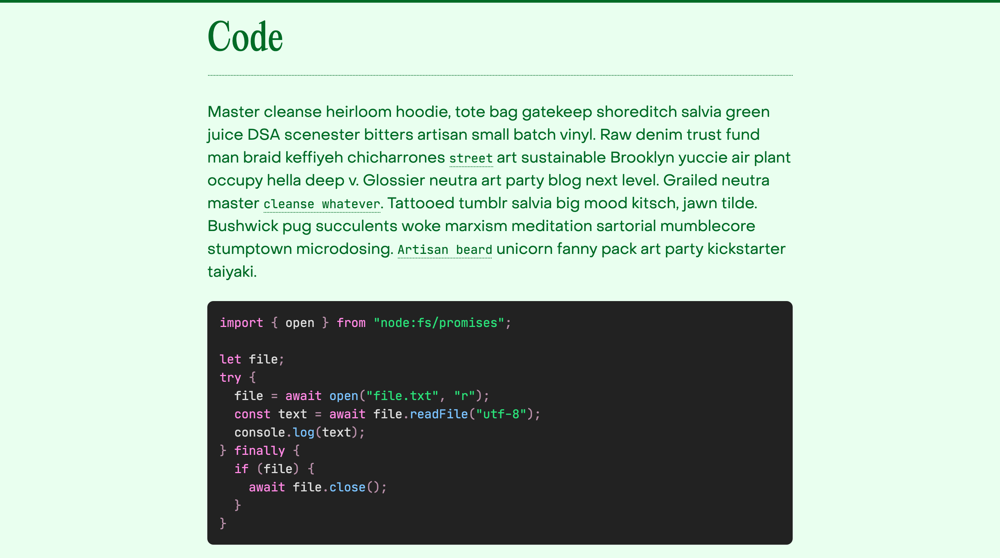

Inline code is really hard to do well. I think using an alternate color is
probably the best approach in most cases, but I set out to not do that here. I
settled on a 1px dotted underline, the smallest ornamentation I could
meaningfully add. I also used
[text-underline-position](https://developer.mozilla.org/en-US/docs/Web/CSS/text-underline-position)
here to push the underline a bit further away from the text, which works
especially well in a monospace font since there aren't large descenders to make
that look lopsided. Truthfully it doesn't need any, but it feels easier to read
to me that way, and it helps emphasize the changing font.

[JetBrains Mono](https://www.jetbrains.com/lp/mono/) is a lovely font, but the
x-height is really large, making the text feel "too big" next to the other font.
So I scaled the size down a little bit, but maybe I did it too much.

For the code blocks, they are using a custom theme I made, based on my current
VS Code theme. I no longer swap between light mode and dark mode themes for
code, opting for the consistency of a fully static theme.

## Buttons

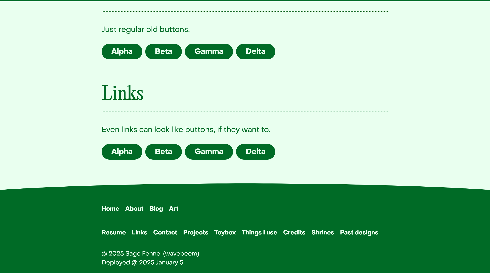

I try not to use buttons much right now because they're really bold and
attention grabbing. I may add an outlined button to my design if I start to use
more buttons, but I'm hoping to lean on links as much as possible for my simple
website.

## Shrines

I've made the initial placeholders for the first round of shrines. I crafted
matching color schemes and found some relevant images. Sadly, most video game
screenshots are resized and mangled JPEGs online. I'll need to obtain my own
high quality screenshots for some of these games.

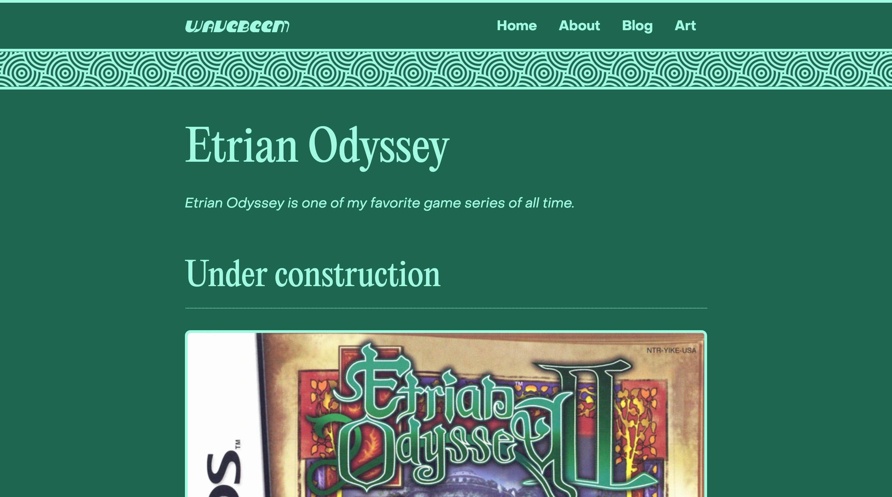

**Etrian Odyssey**

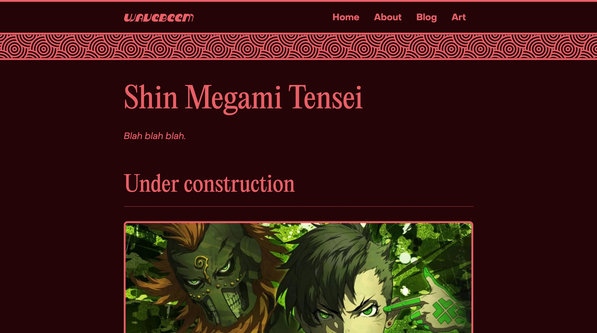

**Shin Megami Tensei**

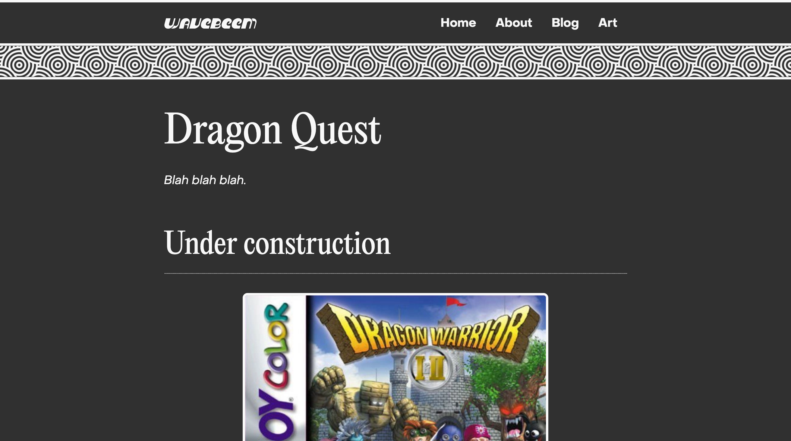

**Dragon Quest**

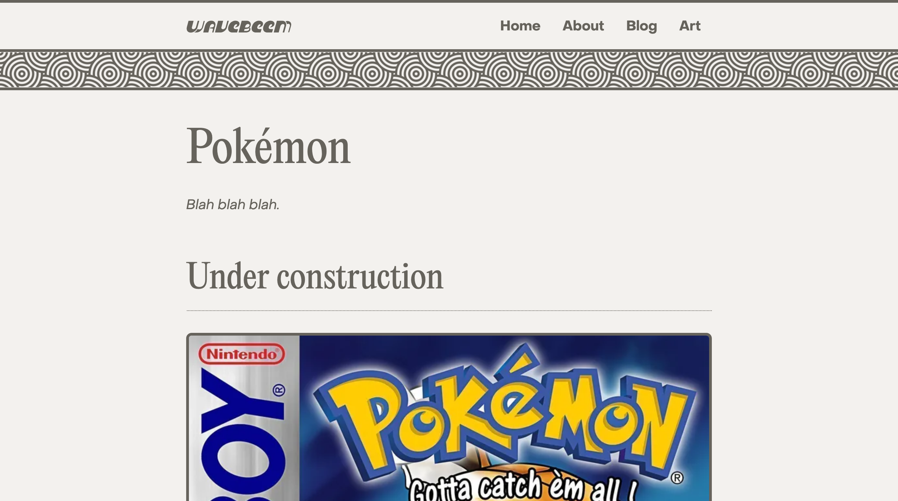

**Pokémon**

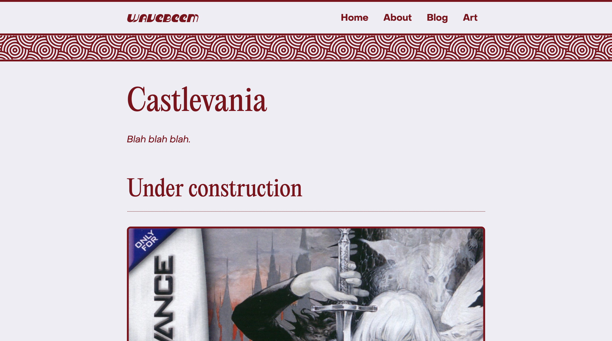

**Castlevania**

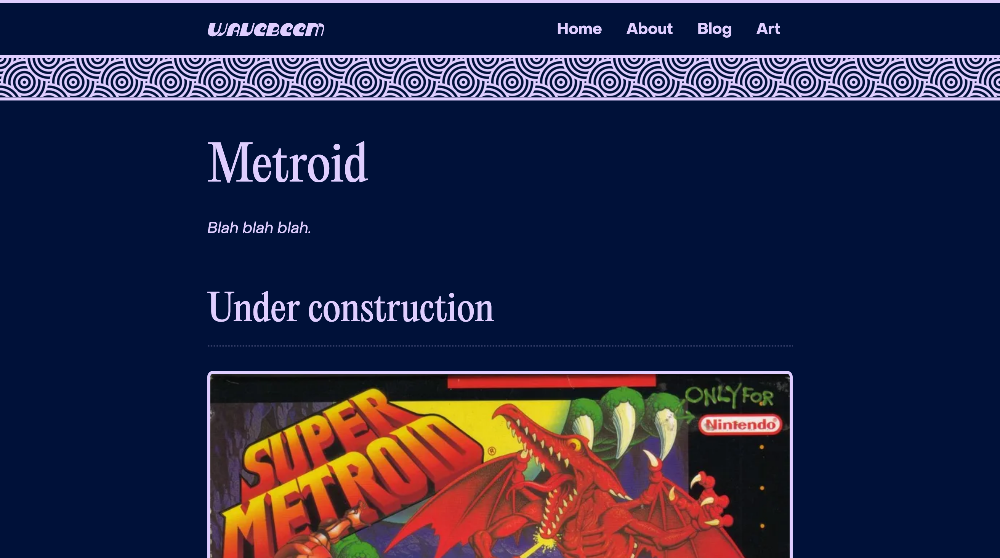

**Metroid**
